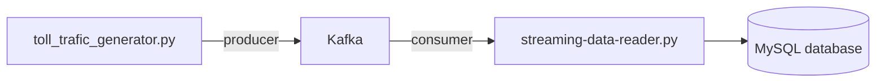
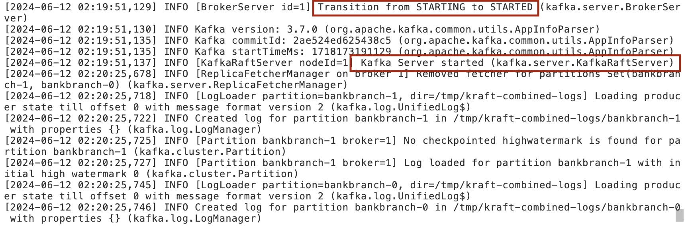
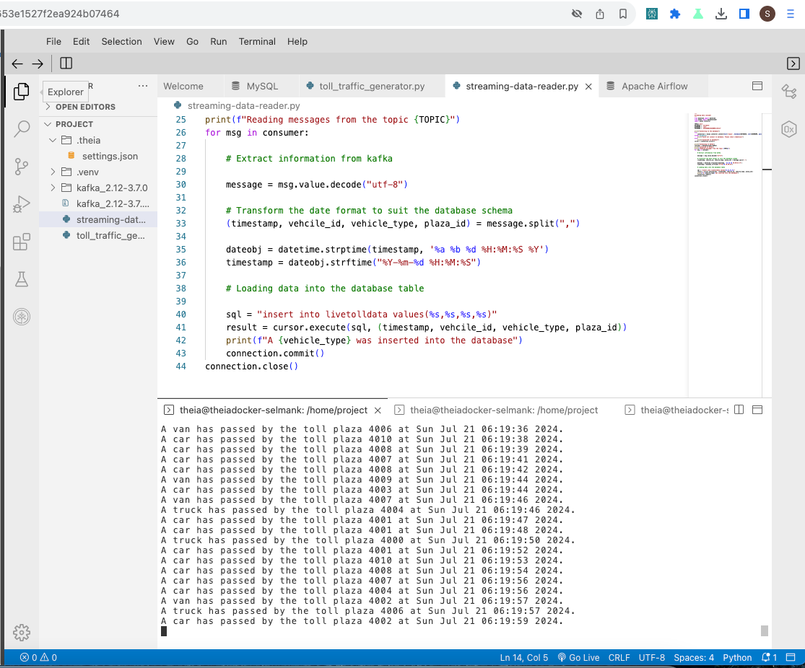
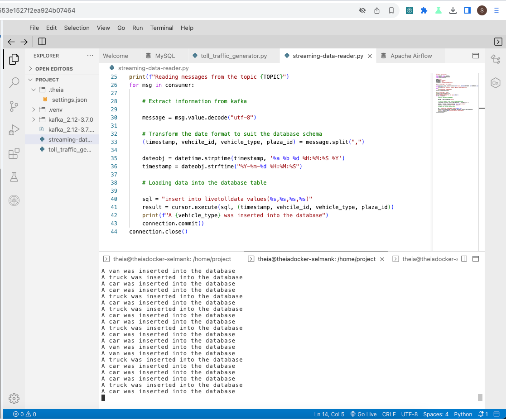
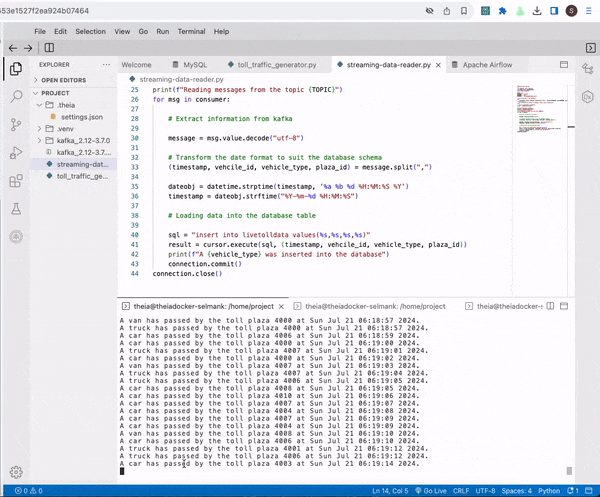

By Selman Karaosmanoglu 

## Date created

21 July 2024

# Streaming ETL Pipeline with Kafka

This project aims to de-congest national highways by analyzing road traffic data from different toll plazas. The data is streamed from toll plazas to Kafka and then loaded into a MySQL database for analysis.

## Architecture



## Getting Started

## Prerequisites

- Apache Kafka 3.7
- Python 3.10
- MySQL


## Tasks

### Configure KRaft and start server

Change to the kafka directory.

#### Generate a cluster UUID that will uniquely identify the Kafka cluster.

```bash
KAFKA_CLUSTER_ID="$(bin/kafka-storage.sh random-uuid)"
```

#### Run the following command to configure the log directories passing the cluster id.

```bash
bin/kafka-storage.sh format -t $KAFKA_CLUSTER_ID -c config/kraft/server.properties
```

#### Start the Kafka server 

```bash
bin/kafka-server-start.sh config/kraft/server.properties
```




### Start a MySQL database server

```bash
mysql --host=mysql --port=3306 --user=root --password=Replace your password
```

### Create a table to hold the toll data

```bash
create database tolldata;

use tolldata;

create table livetolldata(timestamp datetime,vehicle_id int,vehicle_type char(15),toll_plaza_id smallint);

```

### Install the Kafka Python driver

```bash
pip3 install uv

uv venv

source .venv/bin/activate

uv pip install kafka-python
```

### Install the MySQL Python driver

```bash
uv pip install mysql-connector-python==8.0.31
```

### Create a topic named toll in Kafka

```bash
bin/kafka-topics.sh --create --topic toll --bootstrap-server localhost:9092
```

### Run streaming data generator program

```bash
python toll_traffic_generator.py
```



### Run streaming data consumer

```python
# Configure streaming data reader accordingly
TOPIC

DATABASE

USERNAME

PASSWORD

```

```bash
python streaming-data-reader.py
```



### Verify that streamed data is being collected in the database table

Open Mysql CLI

run

```bash
SELECT * FROM livetolldata LIMIT 10;
```

### Monitoring



## Contributing

Contributions are welcome! Please open an issue or submit a pull request for any improvements or bug fixes.

## License

This project is licensed under the MIT License. See the [LICENSE](LICENSE) file for details.